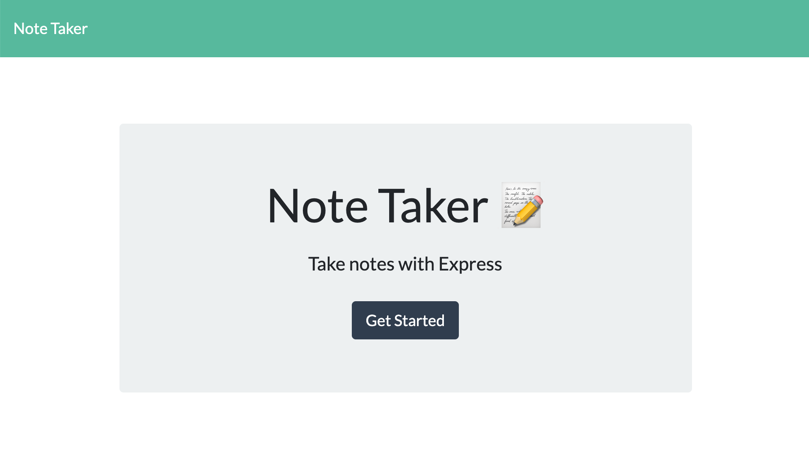

# Express Note Taker
#### This application allows the user to write and save notes.

### On the back-end, this project uses a Javascript server, a JSON file as a temporary database, and is dependent on Express. The front-end consists of HTML, CSS, and JS files, and was built using Bootstrap. Using these tools, I have created an application which allows users to write and save notes. If they would like to view an individual note, they can select it from a list of all saved note titles, and it will be displayed on the screen. When the user deletes a note from the list, it will be removed from the JSON file and no longer be accesible. I have deployed the application using Heroku. 

#### Link to deployed application: [ExpressNoteTaker](https://lit-ravine-39490.herokuapp.com/)
#### 
